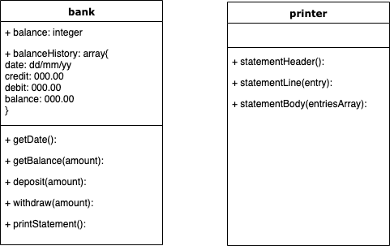
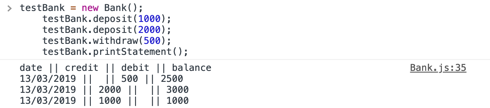

# bank-tech-test

## set up

### clone repo

Clone repo from GitHub by running `git clone https://github.com/wpdunk/bank-tech-test.git`

### install dependencies

Run installation of dependencies with `npm install`

## run tests

Run tests with `karma start karma.conf.js`
For notes on test coverage run project (as below) then follow link.

## run project

Run project `open ./index.html`

## documentation

#### brief

Write a bank program that can accept deposits/withdrawals and print a statement history with (date || credit || debit || balance).

**required output:**

```
date || credit || debit || balance
14/01/2012 || || 500.00 || 2500.00
13/01/2012 || 2000.00 || || 3000.00
10/01/2012 || 1000.00 || || 1000.00
```

#### approach

- 2 Classes
- **Bank** handles the deposit and withdrawal logic
- **Printer** handles the formatting of the statement

**structure:**



**screenshot:**


